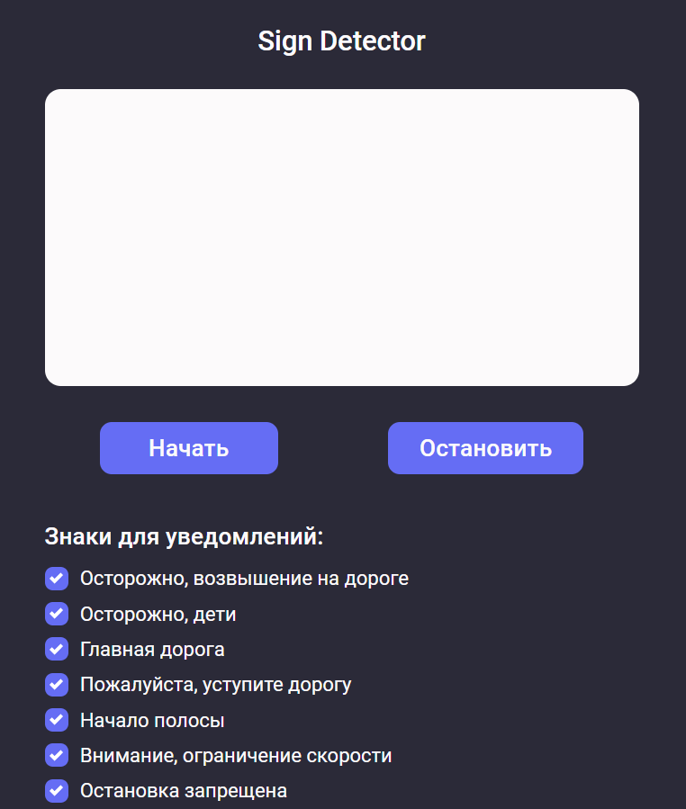

## Сервис распознавания знаков

### Запуск с использованием Docker
```docker-compose
docker-compose up
```

### Запуск локально на Windows 10
1. Выполнить следующие команды:
```cmd
git clone https://github.com/AstuteVisionDL/service.git
cd service
python -m venv venv
venv\Scripts\activate.bat
pip install poetry
poetry install --without dev
```
2. Создать файл .env в директории src со следующими данными:
```
MODE=prod
YOLO_PROB_THRESHOLD=0.1
```
3. Запустить приложение:
```cmd
poetry run uvicorn src.app:app --host 0.0.0.0 --port 8000
```


### Демонстрация

1. Перейти по адресу: http://localhost:8000
2. Нажать на кнопку "Начать" и разрешить использование камеры
3. Направить камеру на дорогу или на видео движения по дороге

При появлении знака на видео будет голосовое оповещение, если данный знак выбран для уведомлений

Для демонстрации можно использовать приложение Fake Webcam, чтобы передавать видео напрямую

### Архитектура
Разработанный демонстрационный вариант сервиса не требует дополнительный зависимостей в виде веб-сервера или базы данных.
Данный сервис раздает статику (ico, css, js) и обрабатывает изображения. Обработка изображений начинается после установления
соединения с клиентом через Websocket, что позволяет не тратить время на повторное установление соединения. 

### Масштабирование
Сервис является stateless и масштабируется добавлением новых экземпляров сервиса и балансировщика нагрузки, например, nginx. 
Однако данное решение требует наличие постоянного соединения с интернетом, что возможно только в городской местности и её небольшой окрестности.

В качестве развития проекта предполагается переиспользование front-end-части приложения и перенос обработки изображения на клиентскую сторону
с помощью библиотеки tensorflow-js. Новое приложение должно разрабатываться как PWA, что позволит использовать его в отсутствии интернет-соединения и
на разных платформах.